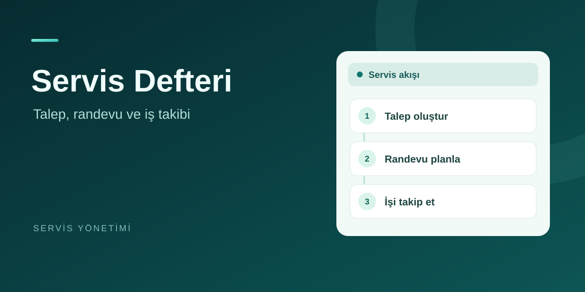

## Öne çıkan projeler

<table>
  <tr>
    <td width="50%" valign="top">
      
      <h3>SmartDocs AI</h3>
      
PDF üzerinde soru-cevap ve kaynak inceleme. Gemini destekli canlı sürüm, Ollama ile yerel kurulum.

      
<a href="https://smartdocs-ai-henna.vercel.app/">Uygulamayı aç ↗</a> · <a href="https://github.com/Nurettin-Erdogan/smartdocs-ai">Kaynak kod</a>

    </td>
    <td width="50%" valign="top">
      
      <h3>Servis Defteri</h3>
      
Servis taleplerini, randevuları ve iş takibini tek yerde bir araya getiren servis yönetimi uygulaması.

      
<a href="https://islik-cloud.vercel.app/">Uygulamayı aç ↗</a>

    </td>
  </tr>
  <tr>
    <td width="50%" valign="top">
      
      <h3>Türkiye Hava</h3>
      
İl ve ilçe hava tahminlerini sunan, son tahmine çevrimdışı erişilebilen ve cihaza kurulabilen hava uygulaması.

      
<a href="https://turkiye-hava-pwa.vercel.app/">Uygulamayı aç ↗</a> · <a href="https://github.com/Nurettin-Erdogan/weather-app">Kaynak kod</a>

    </td>
    <td width="50%" valign="top"></td>
  </tr>
</table>

**Diğer çalışma:** [Görev Listesi](https://gorev-listesi-pwa.vercel.app/) — Çevrimdışı kullanılabilen görev yöneticisi. [Kaynak kod](https://github.com/Nurettin-Erdogan/todo-app)

### Teknolojiler

C# · ASP.NET Core · React · Node.js · PostgreSQL · Docker

### Deneyim ve eğitim

**Darphane ve Damga Matbaası Genel Müdürlüğü** · Bilgi Teknolojileri Stajyeri 
Temmuz–Ağustos 2026 · Yazılım testleri, yetkilendirme akışları ve barkod entegrasyonu testleri.

**İstanbul Atlas Üniversitesi** · Bilgisayar Mühendisliği · 2023–devam ediyor

[CV](./assets/Nurettin_Erdogan_CV.pdf) · [E-posta](mailto:enurettin89@gmail.com) · [LinkedIn](https://www.linkedin.com/in/nurettin-e-7b5508289/)
