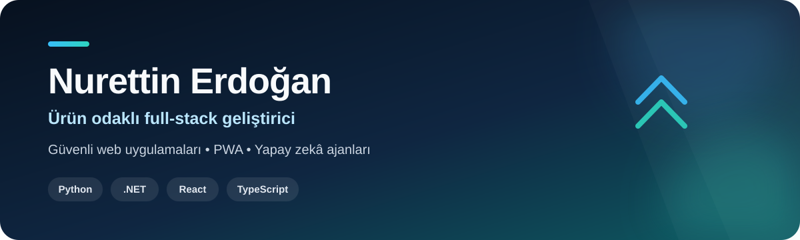

  

  Bilgisayar Mühendisliği · Tahmini mezuniyet: <strong>2027</strong> · İstanbul, Türkiye 
  <strong>Staj · Yarı zamanlı · Junior</strong> fırsatlarına açığım

  Güvenli API'ler, yapay zekâ destekli ürünler, otomatik testler ve CI süreçleriyle çalışan yazılımlar geliştiriyorum.

  <a href="https://nurettin-erdogan-portfolio.enurettin89.chatgpt.site"><strong>Kişisel portföy</strong></a>
  &nbsp;·&nbsp;
  <a href="https://smartdocs-ai-henna.vercel.app/"><strong>SmartDocs canlı demo</strong></a>
  &nbsp;·&nbsp;
  <a href="https://ajan-kalkani.vercel.app/"><strong>Ajan Kalkanı sandbox</strong></a>
  &nbsp;·&nbsp;
  <a href="https://www.linkedin.com/in/nurettin-e-7b5508289/"><strong>LinkedIn</strong></a>
  &nbsp;·&nbsp;
  <a href="https://nurettin-erdogan-portfolio.enurettin89.chatgpt.site/Nurettin_Erdogan_CV.pdf"><strong>CV</strong></a>

---

## Öne çıkan projeler

<table>
  <tr>
    <td width="50%" valign="top">
      
      <h3>SmartDocs AI</h3>
      
PDF belgelerinden kaynaklı yanıtlar üreten; kimlik doğrulama, sahiplik sınırları, kalıcı veri ve RAG akışını birleştiren tam yığın uygulama.

      
<code>React</code> <code>TypeScript</code> <code>.NET</code> <code>PostgreSQL</code> <code>Qdrant</code> <code>Ollama</code>

      
<strong>Kalite kanıtı:</strong> 26 backend + 14 frontend testi · CI · CodeQL · Docker

      
<a href="https://smartdocs-ai-henna.vercel.app/"><strong>Vitrin demosunu aç</strong></a> · <a href="https://github.com/Nurettin-Erdogan/smartdocs-ai">Kaynak kod</a>

    </td>
    <td width="50%" valign="top">
      
      <h3>Ajan Kalkanı</h3>
      
AI ajanlarının araç çağrılarını capability sözleşmeleriyle sınırlar; prompt injection etkisini yürütme katmanında azaltır ve güvenlik regresyonlarını CI’da ölçer.

      
<code>Python</code> <code>FastAPI</code> <code>Pytest</code> <code>Policy Engine</code> <code>Agent CI</code>

      
<strong>Kalite kanıtı:</strong> 54 test · 3 Python sürümü · güvenlik kalite kapısı · CodeQL

      
<a href="https://ajan-kalkani.vercel.app/"><strong>Sandbox demosunu aç</strong></a> · <a href="https://github.com/Nurettin-Erdogan/ajan-kalkani">Kaynak kod</a>

    </td>
  </tr>
  <tr>
    <td width="50%" valign="top">
      
      <h3>Türkiye Hava PWA</h3>
      
Türkiye il ve ilçeleri için gerçek hava verisini hızlı, erişilebilir, gizlilik odaklı ve kurulabilir bir PWA deneyiminde sunar.

      
<code>JavaScript</code> <code>PWA</code> <code>Open-Meteo</code> <code>Playwright</code>

      
<strong>Kalite kanıtı:</strong> 34 otomatik kontrol · çevrimdışı davranış · güvenlik başlıkları

      
<a href="https://turkiye-hava-pwa.vercel.app/"><strong>Canlı uygulamayı aç</strong></a> · <a href="https://github.com/Nurettin-Erdogan/weather-app">Kaynak kod</a>

    </td>
    <td width="50%" valign="top">
      
      <h3>Görev Listesi</h3>
      
Görev, öncelik, tarih, sekmeler arası senkronizasyon ve çevrimdışı kullanımı cihazda kalan sade bir planlama akışında toplar.

      
<code>JavaScript</code> <code>PWA</code> <code>Local-first</code> <code>Playwright</code>

      
<strong>Kalite kanıtı:</strong> 5 uçtan uca senaryo · PWA doğrulaması · CodeQL

      
<a href="https://gorev-listesi-pwa.vercel.app/"><strong>Canlı uygulamayı aç</strong></a> · <a href="https://github.com/Nurettin-Erdogan/todo-app">Kaynak kod</a>

    </td>
  </tr>
</table>

## Deneyim

### Bilgi Teknolojileri Stajyeri

**Darphane ve Damga Matbaası Genel Müdürlüğü** · Temmuz 2026 — Ağustos 2026

- DBS uygulamasının fonksiyonel testlerini gerçekleştirdim.
- GitLab üzerinde ayrıntılı hata raporları oluşturdum.
- Kullanıcı, rol ve yetkilendirme süreçlerini test ettim.
- Barkod okuyucu entegrasyon testlerine katıldım.
- Yazılım ekibiyle hata doğrulama ve yeniden test süreçlerinde çalıştım.

## Eğitim

**İstanbul Atlas Üniversitesi** · Bilgisayar Mühendisliği · 2023 — Devam Ediyor  
Tahmini mezuniyet: **2027**

## Şu an odaklandığım çalışmalar

- **SmartDocs AI:** ASP.NET Core, React, PostgreSQL, Qdrant ve Ollama ile kaynaklı PDF soru-cevap akışı, kullanıcı sahipliği ve güvenli belge işleme.
- **Ajan Kalkanı:** AI ajanlarının araç çağrılarını capability sözleşmeleriyle sınırlayan, default-deny politika motoru ve güvenlik regresyonlarını ölçen Agent CI yaklaşımı.

## Teknik yetkinlikler

- **Backend ve veri:** C# · ASP.NET Core · REST API · JWT · EF Core · PostgreSQL · SQL Server · Python · FastAPI
- **AI / RAG:** Ollama · Qdrant · Embedding · Semantik arama · Kaynaklı cevaplar · AI agent güvenliği
- **Frontend:** React · TypeScript · JavaScript · PWA · Responsive web arayüzleri
- **DevOps ve kalite:** Docker · Git / GitHub · GitHub Actions · CodeQL · Playwright · Pytest · Otomatik test ve CI kalite kapıları
- **Güvenlik:** Rate limiting · Güvenlik başlıkları · Kullanıcı/veri sahipliği kontrolleri · Default-deny politika yaklaşımı · Güvenli dosya yükleme

## Çalışma yaklaşımım

Bir projeyi yalnızca çalışan kod olarak değil; **canlı demo, anlaşılır dokümantasyon, testler, CI, güvenli varsayılanlar ve tekrarlanabilir kurulum** ile birlikte tamamlamaya odaklanıyorum.

## İletişim

- **Portföy:** [nurettin-erdogan-portfolio.enurettin89.chatgpt.site](https://nurettin-erdogan-portfolio.enurettin89.chatgpt.site)
- **LinkedIn:** [Nurettin Erdoğan](https://www.linkedin.com/in/nurettin-e-7b5508289/)
- **E-posta:** [enurettin89@gmail.com](mailto:enurettin89@gmail.com)

Projelerin canlı demoları ve kaynak depoları yukarıdaki kartlardan incelenebilir.
